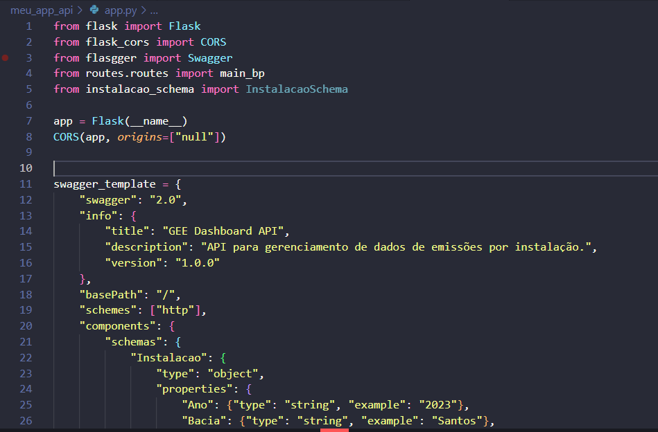
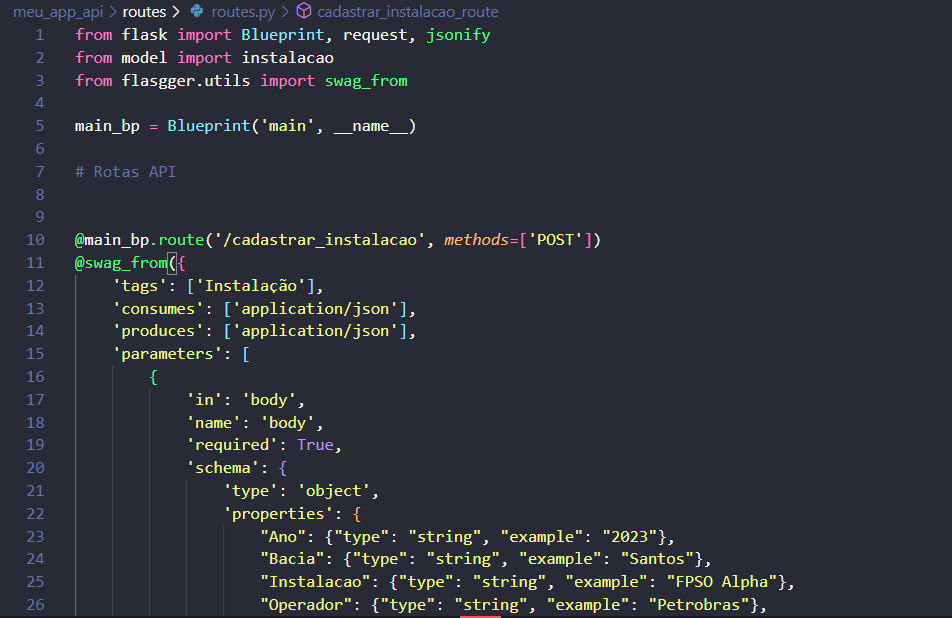
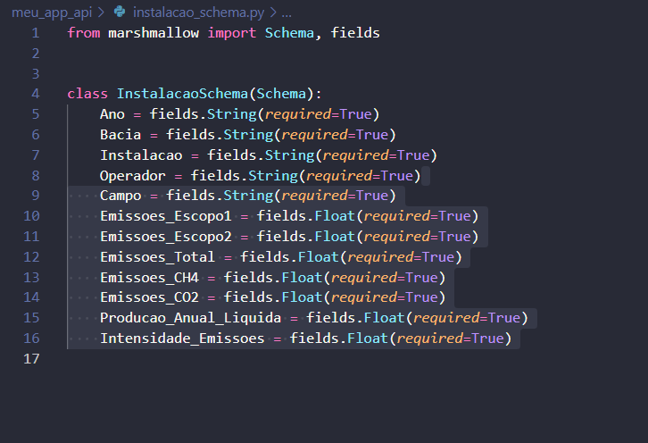
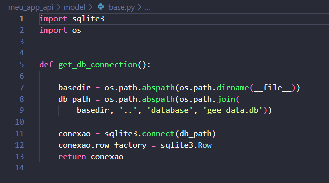
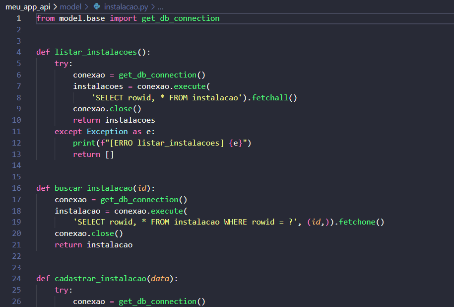
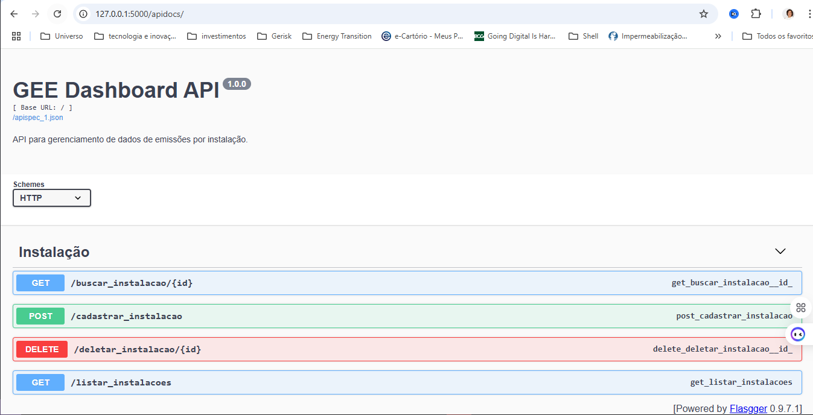

# GEE Dashboard - Backend (API)

Este projeto é o backend da aplicação GEE Dashboard, desenvolvido em Flask. Ele expõe uma API REST para gerenciamento de dados de emissões de gases de efeito estufa (GEE) por instalação offshore.

## 🔧 Instalação e Configuração

### Siga os passos abaixo para executar o projeto localmente:

#### Crie e ative um ambiente virtual:

python -m venv venv

venv\Scripts\activate

#### Instale as dependências:

pip install -r requirements.txt

#### Execute a aplicação:

python app.py

## A API estará disponível em:

http://127.0.0.1:5000/

## Acesse a documentação Swagger em:

http://127.0.0.1:5000/apidocs/

## Estrutura:

### app.py: ponto de entrada da aplicação



### routes/: rotas da API



### instalacao_schema.py: schema de validação



### model/: funções de acesso ao banco de dados





### swagger: documentação interativa com Flasgger



## Requisitos:

Python 3.10 ou superior

Flask

SQLite3

### 1. Clone o repositório
```bash
git clone <URL-do-repositório>
cd meu_app_api
